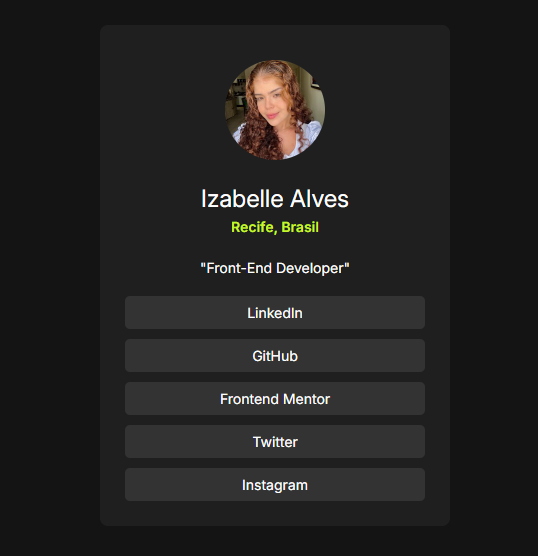

# Profile Social Links

Este projeto é um mini-portfólio básico para exibir informações e links para as redes sociais.

## Visualização do Projeto

Você pode visualizar a aplicação rodando em: .

## Tecnologias Utilizadas

- HTML5
- CSS3

## Estrutura do Projeto

- **index.html**: Estrutura básica da página, contendo os elementos e links principais.
- **index.css**: Estilos para formatação, alinhamento, responsividade e efeito de hover.

## Design Responsivo

O design foi desenvolvido para se adaptar às seguintes resoluções:

1. **Mobile (375px)**: O layout é compacto, com links em coluna e centralização.
2. **Desktop (1440px)**: O layout aumenta o tamanho dos elementos e o espaçamento para preencher a tela de forma confortável.

## Estilos de Links

Cada link é estilizado com:

- Um fundo escuro.
- Texto branco e efeito de `:hover`.
- Bordas arredondadas e espaçamento interno para melhor acessibilidade.

**_Entre em contato comigo_**

- **E-mail**: [izabelle.alvesbl@gmail.com](mailto:izabelle.alvesbl@gmail.com)
- **LinkedIn**: [Izabelle Alves](https://www.linkedin.com/in/izabellealvess/)
